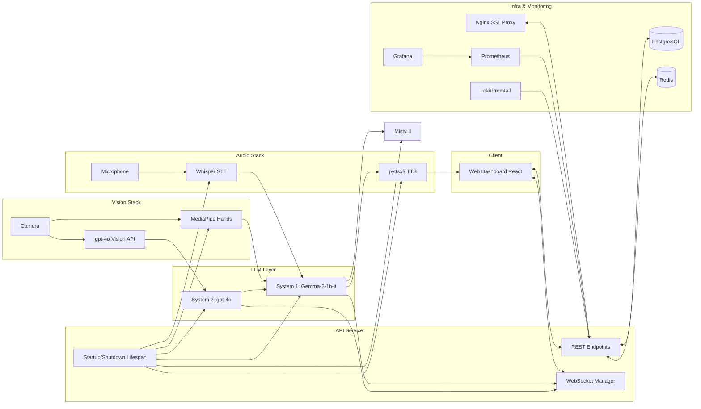

# Technology Overview and System Interactions

The code for TheraMisty is still currently private, but this document serves to outline the system and its design justifications. 

## Runtime and Orchestration

- **FastAPI**: Hosts the production API, lifecycle-manages startup/shutdown, and exposes REST + WebSocket endpoints for unattended operation.
  (lifespan context initializes agents, audio, robot controller, multimodal integration; global exception handler provides reliability).
- **Uvicorn**: ASGI server to run the FastAPI application.
- **Background Tasks & Threads**: Continuous real-time loops for audio (capture/transcription), multimodal processing, and WebSocket heartbeats/cleanup.

## Language Models (LLMs)

- **System 1 LLM: google/gemma-3-1b-it (Transformers + PEFT + VLLM)**
  - Purpose: Low-latency therapy responses.
  - Access: HuggingFace Transformers for CPU/dev with PEFT LoRA adapters; VLLM for GPU/production using `LoRARequest` and `SamplingParams`.
  - Why: Strong quality at small model size; LoRA enables efficient domain adaptation; VLLM provides 9–15x speedups when GPUs exist.

- **System 2 LLM: OpenAI gpt-4o (OpenAI Chat Completions API)**
  - Purpose: Strategic reasoning, planning/evaluation, JSON tool outputs; also multimodal scene analysis.
  - Access: OpenAI Python SDK for text; REST `/v1/chat/completions` for text+image.
  - Why: State-of-the-art reasoning/vision without hosting overhead.

## Speech and Audio

- **Whisper (STT)**
  - Purpose: Real-time transcription from microphone.
  - Access: `openai-whisper` local model `whisper.load_model("base")`, coordinated with `SpeechRecognition` and `PyAudio`.
  - Why: Robust accuracy, offline capability, low latency.

- **pyttsx3 (TTS)**
  - Purpose: Offline text-to-speech for immediate feedback.
  - Access: Local engine initialization and tuning (rate, volume, voice).
  - Why: Zero API latency/cost; deterministic in clinical settings.

## Vision

- **MediaPipe Hands**
  - Purpose: Local, real-time gesture detection to augment context.
  - Access: `mediapipe.solutions.hands` with tuned detection/tracking thresholds.
  - Why: Fast and reliable on commodity hardware; no cloud dependency.

- **OpenAI gpt-4o (Multimodal Scene Analysis)**
  - Purpose: Analyze frames for objects, engagement, attention focus, room context.
  - Access: REST `POST /v1/chat/completions` with `image_url` alongside a structured prompt; response parsed as JSON.
  - Why: High-level visual reasoning without hosting a vision LLM.

## Robot Integration

- **Misty II via mistyPy**
  - Purpose: Execute therapy actions (speak, gestures, head/arms, expressions), LED states, image capture.
  - Access: `mistyPy.Robot` methods wrapped in therapy-specific helpers with error handling.
  - Why: Direct, reliable control suited for clinical workflows with safety/fallbacks.

## Backend Selection and Performance

- **Hybrid Backend (VLLM vs HuggingFace)**
  - Purpose: Automatically select the optimal inference backend based on environment (GPU vs CPU) with `THERAMIS_BACKEND` override.
  - Why: Portability + performance across dev and prod without manual toggles.

- **PEFT (LoRA) + Transformers**
  - Purpose: Efficient fine-tuning of System 1 on 250+ therapy samples.
  - Why: Domain adaptation with minimal compute and small deployable adapters.

## Web/API Layer

- **FastAPI + Pydantic**
  - Purpose: Typed APIs, health/session endpoints, exception handling, CORS.

- **WebSockets**
  - Purpose: Real-time therapist dashboard updates (transcripts, engagement, robot actions, alerts).

## Observability, Security, and Infra

- **Logging**: Standard logging across services; high-signal init, timing, and error logs.
- **Monitoring Stack**: Prometheus, Grafana, Loki, Promtail described and wired in `docker-compose.production.yml`, with configs in `monitoring/`.
- **Security**: JWT, CORS, and environment-based secrets; Nginx reverse proxy with SSL in production compose.
- **Data Services**: Optional PostgreSQL and Redis services provisioned in production compose for session data and caching.

## End-to-End System Interaction Diagram

## Coverage Checklist

- LLMs: Gemma (HF/VLLM + LoRA), gpt-4o (text + vision) — covered.
- Audio: Whisper STT, pyttsx3 TTS — covered.
- Vision: MediaPipe Hands, GPT‑4o multimodal — covered.
- Robot: Misty via mistyPy — covered.
- API/Web: FastAPI, WebSockets, Pydantic, Uvicorn — covered.
- Infra: Docker Compose (API, Web, Nginx, Postgres, Redis), Monitoring (Prometheus, Grafana, Loki, Promtail) — covered.
- Config/Perf: Hybrid backend selection, LoRA fine-tuning, environment-driven config — covered.

